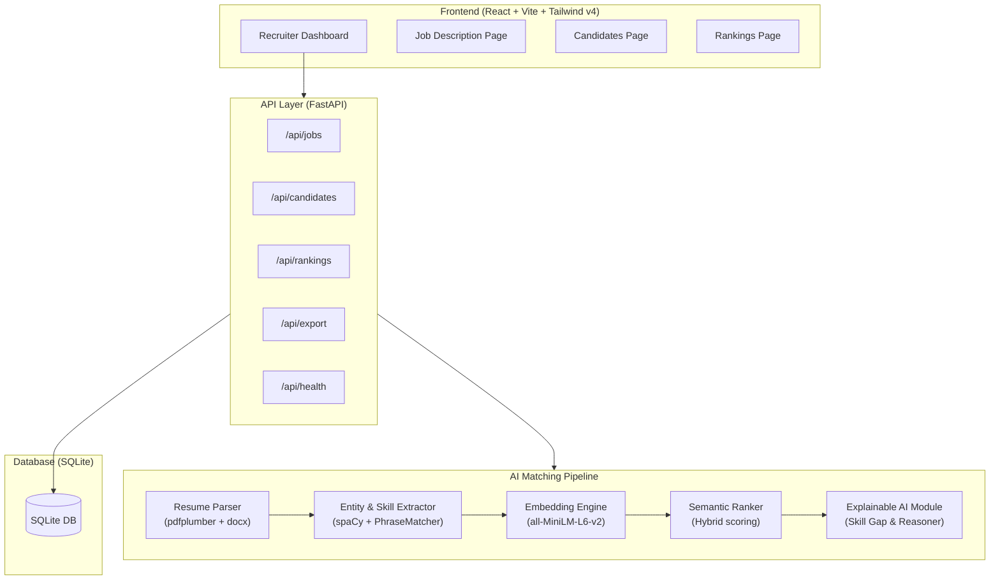

# SemantiHire AI 🚀
> **Semantic Labs** · Hack2Skill INDIA RUNS Data & AI Challenge MVP

**SemantiHire AI** is a production-ready AI-powered hiring platform that understands candidate profiles **semantically** instead of relying on outdated, keyword-based resume scanning. By matching candidate resumes against job descriptions contextually, SemantiHire AI provides high-precision talent mapping, hybrid scoring, and explainable AI insights for recruiters.

---

## 🏗️ Software Architecture



---

## 🧠 AI MATCHING ENGINE & HYBRID SCORING

Unlike traditional ATS platforms that perform literal keyword matching, SemantiHire AI uses a multi-layered hybrid scoring algorithm:

$$\text{Overall Score} = (0.60 \times \text{Semantic Fit}) + (0.30 \times \text{Skill Match}) + (0.10 \times \text{Experience Level Match})$$

1. **Semantic Fit (60%):** Computes the cosine similarity of the dense vector embeddings (`all-MiniLM-L6-v2`) of the full job description and the full resume. This captures conceptual alignment (e.g., understanding that a resume mentioning "Neural Networks" and "PyTorch" is a strong match for a "Deep Learning Engineer" JD, even if the exact words don't overlap).
2. **Skill Profile Match (30%):** A custom PhraseMatcher checks candidate profiles against a curated list of over 200 technical and soft skills, computing the Jaccard similarity between the job's required skills and the candidate's parsed skills.
3. **Experience Match (10%):** Inferred from text heuristics. If the candidate's level (entry, mid, senior, executive) matches the job profile, they receive a full bonus; adjacent matches receive a partial bonus.

### Explainable AI (XAI)
Every recommendation comes with a transparent breakdown:
- **Matched Skills:** Visual green badges showing technical alignment.
- **Missing Skills:** Visual red badges highlight skill gaps.
- **Natural Language Summary:** Text explanation explaining *why* the candidate is ranked where they are (e.g., *"Strong semantic match (85%) with 7/9 required skills. Missing: Kubernetes, Terraform"*).

---

## 📂 Project Structure

```
SemantiHire-AI/
├── backend/
│   ├── app/
│   │   ├── ai/                 # Embeddings, Parser, NER, Ranker, Explainer
│   │   ├── core/               # Database and environment configurations
│   │   ├── models/             # SQLAlchemy ORM models (SQLite)
│   │   ├── routers/            # API Endpoints
│   │   ├── schemas/            # Pydantic validation DTOs
│   │   ├── services/           # Service layer coordinating DB and ML pipelines
│   │   └── main.py             # FastAPI bootstrap
│   ├── uploads/                # Directory for uploaded resume files
│   ├── exports/                # Generated CSV reports
│   └── requirements.txt        # Backend dependencies
│
└── frontend/
    ├── src/
    │   ├── components/         # Reusable UI primitives and layouts
    │   ├── hooks/              # Custom React hooks (useJobs, useCandidates, etc.)
    │   ├── pages/              # Dashboard, Jobs, Candidates, Rankings, 404
    │   ├── services/           # Fetch-based API client wrapper
    │   ├── App.jsx             # React Router v7 routes
    │   └── main.jsx            # React root mount
    ├── vite.config.js          # Vite config with backend API proxying
    └── package.json            # Frontend dependencies
```

---

## ⚡ Setup & Installation

### 1. Prerequisites
- Python 3.10+
- Node.js 18+

### 2. Backend Setup
1. Navigate to the backend directory:
   ```bash
   cd backend
   ```
2. Create a virtual environment and activate it:
   ```bash
   # Windows
   python -m venv venv
   .\venv\Scripts\activate

   # macOS/Linux
   python3 -m venv venv
   source venv/bin/activate
   ```
3. Install dependencies:
   ```bash
   pip install -r requirements.txt
   ```
4. Download the spaCy language model:
   ```bash
   python -m spacy download en_core_web_sm
   ```
5. Copy environment file and start the server:
   ```bash
   copy .env.example .env
   uvicorn app.main:app --reload --port 8000
   ```
   *The backend documentation will be accessible at: `http://localhost:8000/docs`*

### 3. Frontend Setup
1. Open a new terminal and navigate to the frontend directory:
   ```bash
   cd frontend
   ```
2. Install npm packages:
   ```bash
   npm install
   ```
3. Start the development server:
   ```bash
   npm run dev
   ```
   *The frontend dashboard will be accessible at: `http://localhost:5173`*

---

## 📡 API Reference

| Endpoint | Method | Description |
| :--- | :--- | :--- |
| `/api/jobs` | `POST` | Creates a new job profile and extracts skills |
| `/api/jobs` | `GET` | Lists all active job listings |
| `/api/candidates/upload` | `POST` | Uploads and parses multiple PDF/DOCX resumes |
| `/api/candidates` | `GET` | Lists all candidate profiles |
| `/api/rankings/compute/{job_id}` | `POST` | Computes the hybrid semantic rankings |
| `/api/rankings/{job_id}` | `GET` | Gets the calculated ranking list |
| `/api/export/{job_id}` | `GET` | Downloads the ranked candidate list as a CSV file |
| `/api/health` | `GET` | API status health check |

---

## 🧪 Verification & Demo Guide
For a quick test flow:
1. Open the UI at `http://localhost:5173`.
2. Go to **Jobs**, paste a Job Description (e.g. "React developer with 3+ years experience. Need skills: JavaScript, CSS, HTML, Webpack, Git, Tailwind CSS"). Click **Analyze Job**.
3. Go to **Candidates**, upload some test resumes (PDF/DOCX). Click **Upload & Parse**.
4. Click on the job in the **Jobs** tab.
5. Click **Rank Candidates**. You will see the AI hybrid score, score breakdown, matching skills, missing skills, and detailed explanations.
6. Click **Export CSV** to get the spreadsheet download.
